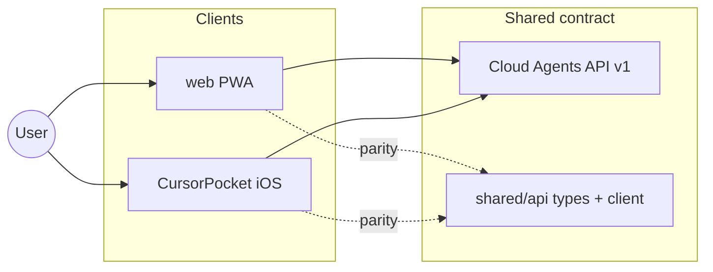

# Cursor Pocket — architecture

## Goal

One product experience: **connect your Cursor account → describe an idea → cloud agents run → you get streamed answers and (optionally) code/PRs** — with minimal friction.

Because iOS builds require a Mac, we develop **web-first** and keep **iOS in parallel** against the same API contract.



## Account model (today)

| Step | UX | Implementation |
|------|-----|----------------|
| Subscribe to Cursor | Link to [cursor.com](https://cursor.com) / dashboard | Not in-app billing |
| Connect account | Paste **API key** from [dashboard](https://cursor.com/dashboard) | Web: `localStorage`; iOS: Keychain |
| Future OAuth | If Cursor ships third-party OAuth | Replace key paste flow |

Usage is billed to the user’s **existing Cursor plan** via the API key — no separate Pocket subscription.

## Frictionless journey

1. **Connect** — validate key with `GET /v1/me`.
2. **Idea** — single composer: “What do you want to build?” (default: chat-only, no repo).
3. **Agent** — `POST /v1/agents` → cloud VM starts (repo attached only if user disabled chat-only and set a GitHub URL).
4. **Stream** — `GET .../runs/{id}/stream` (SSE) → live assistant text in UI.
5. **Outcome** — link to [cursor.com/agents/{id}](https://cursor.com/agents); when the agent pushes, show branch/PR from run `git` payload (iOS/web roadmap).

Repo is **optional** for Q&A; required only when the agent must edit Git (same as official web agents).

## Web-first dev loop

| Phase | Where | Test how |
|-------|--------|----------|
| API + UX | `web/` | `npm run dev` in browser; CI `npm run build` |
| Native polish | `CursorPocket/` | Xcode on Mac |
| Parity check | `shared/api/` + this doc | Compare behavior side-by-side |

Deploy web to GitHub Pages or Cloudflare Pages later for a always-testable demo URL.

## iOS parity matrix

| Feature | Web | iOS |
|---------|-----|-----|
| API key connect | ✅ | ✅ |
| Agent list | ✅ | ✅ |
| Idea → new agent | ✅ | ✅ |
| Follow-up messages | ✅ | ✅ |
| SSE streaming | ✅ | ✅ |
| Chat-only mode | ✅ | ✅ |
| Optional GitHub repo | ✅ | ✅ |
| PWA install | ✅ | N/A |
| Keychain storage | — | ✅ |

## Repository layout

```
cursor-pocket/
├── shared/api/       # TS API client (reference)
├── web/              # Vite + React PWA (testable anywhere)
├── CursorPocket/     # SwiftUI (XcodeGen)
├── docs/             # Architecture & product
└── project.yml       # iOS only
```

## What we are not building (yet)

- In-app Cursor subscription purchase (App Store / Stripe)
- Replacing Cursor desktop IDE
- Local “My Machines” worker on phone
- Full GitHub OAuth repo picker (until API supports it cleanly)

See [ROADMAP.md](../ROADMAP.md) for ordered next steps.
