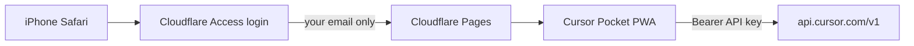

# Cloudflare Access — private Pocket on your phone

**Recommended setup** for a phone-testable URL that is **secured to your email** before anyone sees the app.

Two layers:

| Layer | What it does |
|-------|----------------|
| **Cloudflare Access** (edge) | Login with your email (OTP) to open the site at all |
| **Cursor API key** (app) | Connects Pocket to your Cursor subscription for agents |

Access runs on Cloudflare’s network — not in the Pocket repo and not AWS CloudWatch.

---

## Architecture



---

## Automated setup (API script)

From a machine with your Cloudflare token (not stored in this repo):

```bash
git clone https://github.com/hourdays/cursor-pocket.git
cd cursor-pocket
chmod +x scripts/setup-cloudflare.sh

export CLOUDFLARE_API_TOKEN="..."   # Pages Edit + Access Edit
export CLOUDFLARE_ACCOUNT_ID="..."  # required if your token sees multiple accounts
export POCKET_ALLOWED_EMAIL="you@example.com"

./scripts/setup-cloudflare.sh
```

The script uses Cloudflare APIs to:

1. Verify your token  
2. Detect account ID, or stop if your token can access multiple accounts  
3. Create (or update) an **Access application** on `cursor-pocket.pages.dev`  
4. Add and verify an **Allow** policy for your email only  
5. Print `gh secret set` commands for GitHub Actions deploy  

Then paste secrets and run **Deploy to Cloudflare Pages** workflow.

### What cloud agents cannot do from GitHub alone

| Action | Who |
|--------|-----|
| Create Cloudflare API token | **You** (dashboard) |
| Run `setup-cloudflare.sh` | **You** (token stays local) |
| `gh secret set` for CF tokens | **You** (repo admin) |
| Enable GitHub Pages | **You** (repo settings) |
| Push code + workflows | ✅ Already in repo |

---

## Part 1 — Deploy to Cloudflare Pages

### 1. Cloudflare API token

1. [Cloudflare dashboard](https://dash.cloudflare.com/) → **My Profile → API Tokens**
2. **Create Token** → template **Edit Cloudflare Workers** (includes Pages)
3. Permissions: **Account → Cloudflare Pages → Edit** and **Zero Trust → Access: Apps and Policies → Edit**
4. Copy the token

### 2. GitHub secrets

[hourdays/cursor-pocket → Settings → Secrets → Actions](https://github.com/hourdays/cursor-pocket/settings/secrets/actions)

| Secret | Value |
|--------|--------|
| `CLOUDFLARE_API_TOKEN` | Token from step 1 |
| `CLOUDFLARE_ACCOUNT_ID` | Cloudflare dashboard → right sidebar on any zone, or **Workers & Pages** URL |
| `POCKET_ALLOWED_EMAIL` | Your Cursor account email (second layer inside the app) |

### 3. Deploy

Push to `main` or run **Actions → Deploy to Cloudflare Pages**.

First deploy creates project `cursor-pocket`. Your URL will be:

**https://cursor-pocket.pages.dev**

(Custom domain optional — step 5.)

---

## Part 2 — Cloudflare Access (email gate)

### 1. Open Zero Trust

[Cloudflare Zero Trust](https://one.dash.cloudflare.com/) (free tier is enough for personal use).

### 2. Add an identity provider (if needed)

**Settings → Authentication → Login methods**

- **One-time PIN** — email OTP (simplest for personal use)
- Or **Google** / **GitHub** if you prefer SSO

### 3. Create an Access application

**Access → Applications → Add an application → Self-hosted**

| Field | Value |
|-------|--------|
| Application name | `Cursor Pocket` |
| Session duration | e.g. 24 hours |
| Subdomain | Leave blank if using Pages default |
| Domain | `cursor-pocket.pages.dev` (or your custom domain) |

If the domain is not in your account yet, add it under **Workers & Pages → cursor-pocket → Custom domains** first, or protect `*.pages.dev` via the Pages project settings.

**Easier path for `*.pages.dev`:**

1. **Workers & Pages → cursor-pocket → Settings**
2. **Access policy** (if shown) — or use Zero Trust:
3. **Access → Applications → Add**
4. **Application domain:** `cursor-pocket.pages.dev`
5. **Policy name:** `Only me`
6. **Action:** Allow
7. **Include:** Emails → `you@your-email.com` (same as `POCKET_ALLOWED_EMAIL`)

### 4. Test

1. Open **https://cursor-pocket.pages.dev** in a private window
2. You should see **Cloudflare Access** login (email PIN)
3. After login → Pocket connect screen
4. Paste Cursor API key → chat

On iPhone: Safari → URL → after Access login → **Share → Add to Home Screen**. Access session cookie keeps you signed in (until session expires).

---

## Part 3 — Custom domain (optional)

1. **Workers & Pages → cursor-pocket → Custom domains** → add e.g. `pocket.yourdomain.com`
2. DNS must be on Cloudflare (orange cloud)
3. Update the **Access application** domain to `pocket.yourdomain.com`
4. Use that URL on your phone

---

## GitHub Pages vs Cloudflare Pages

| | GitHub Pages | Cloudflare Pages + Access |
|--|--------------|---------------------------|
| URL | `hourdays.github.io/cursor-pocket/` | `cursor-pocket.pages.dev` |
| Email gate at edge | No (app allowlist only) | **Yes (Access)** |
| Setup | Pages → GitHub Actions | CF token + Access policy |

You can run both; **use Cloudflare for your private phone URL.**

---

## Troubleshooting

| Issue | Fix |
|-------|-----|
| Deploy workflow fails | Check `CLOUDFLARE_API_TOKEN` and `CLOUDFLARE_ACCOUNT_ID` secrets |
| No Access login page | Application domain must exactly match the URL; prop can take a few minutes |
| Access works but API key rejected | `POCKET_ALLOWED_EMAIL` must match Cursor `/me` email |
| PWA opens logged out | Access session expired — log in again in Safari |
| “This Pocket site is private” | App-layer allowlist; fix email secret or use matching API key |

---

## Security notes

- **Access** stops strangers from loading the app UI.
- **`POCKET_ALLOWED_EMAIL`** stops another Cursor user’s API key on your deploy (defense in depth).
- API key remains in **browser localStorage** on your phone — do not share the device.
- Access JWT is managed by Cloudflare; Pocket does not need CloudWatch or AWS.
